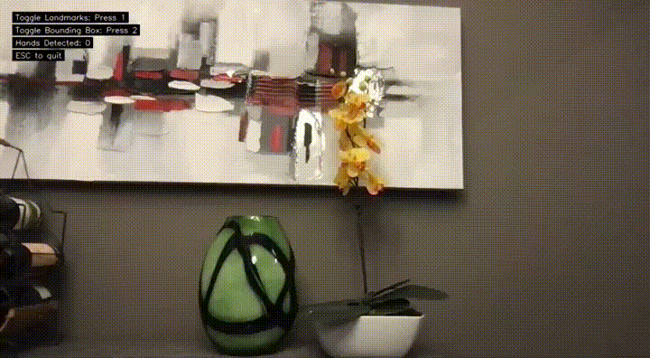
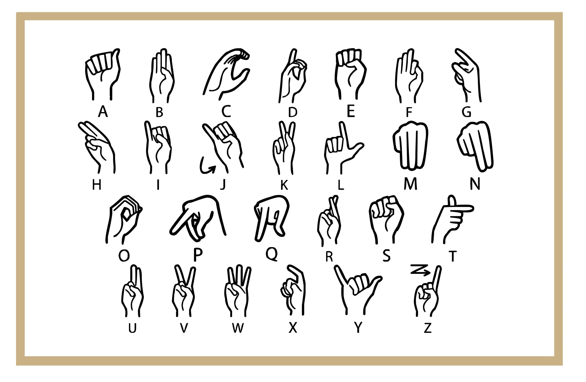

 

  
[](https://www.python.org)
[](https://github.com/psf/black)
[](http://mypy-lang.org/)
[](https://pypi.org/project/ruff/)


# Sign Language Alphabet Translator  <!-- omit from toc -->



## Table of Contents <!-- omit from toc -->

- [Introduction](#introduction)
  - [American Sign Language](#american-sign-language)
  - [Project Objective](#project-objective)
- [Usage](#usage)
  - [Environment Setup](#environment-setup)
  - [Initialization](#initialization)
  - [Quitting](#quitting)
- [Modes](#modes)
  - [Freeform Mode](#freeform-mode)
  - [Data Collection Mode](#data-collection-mode)
- [Machine Learning Model](#machine-learning-model)
  - [Learning](#learning)
  - [Model Summary](#model-summary)
- [Unit Testing](#unit-testing)

## Introduction

### American Sign Language

American Sign Language (ASL) serves as the main sign language of the deaf community in North America. In the language, words and grammar are composed of a combination of hand signals and facial expressions to convey sentences. However, for words without a sign, such as names and loanwords, there exists ASL fingerspelling, where English letters can be individually represented with a hand sign.



For learners of ASL, it may be difficult to find someone from the deaf community to interact with. As such, it is often a challenge receiving adequate practice and feedback, even for something as simple as fingerspelling.

### Project Objective

The Sign Language Alphabet Translator (SLAT) uses machine learning classification algorithms to translate and identify a learner's fingerspelling signs live as it is shown to the computer camera.

## Usage

### Environment Setup

This project requires:
- Python 3.10
- Package manager `poetry`

To install `poetry`, run:

```sh
$ pip install poetry
```

### Initialization

1. Run `make init` to initialize the project by downloading all dependencies.
2. Run `make start` to start the app.

> Run `make` to see a list of other commands.

### Quitting

- Press <kbd>ESC</kbd> to quit the program.
- Alternatively, press <kbd>CTRL</kbd> + <kbd>C</kbd> in the terminal.

## Modes

The application starts in Freeform mode, where hand landmarks are shown. To change modes, press <kbd>TAB</kbd>.

- <kbd>F</kbd> - Freeform mode
- <kbd>D</kbd> - Data Collection mode

In this Select mode, some visual elements can be toggled:

- Press <kbd>1</kbd> to toggle the hand landmarks shown on the screen.
- Press <kbd>2</kbd> to toggle the bounding box.

### Freeform Mode

In Freeform mode, raising your hand will show the predicted ASL letter, along with the confidence level as a decimal perecentage. This works for both the left and right hand, and can detect a maximum of four hands by default. Furthermore, the predictions are displayed independently per hand.

### Data Collection Mode

In this mode, pressing the keys for letters A through Z will log a flattened normalized array of coordinates for the current hand position to the dataset CSV file, in `models/data/key_coordinates.csv`. Each line of coordinates is affixed with the class ID of the letter. For example, all coordinates for the letter A have the class ID of `0`, and the letter B has an ID of `1`, and so forth.


## Machine Learning Model

The current supervised machine learning model was trained on a dataset of flattened normalized arrays of coordinates, that were previously collected. There were 500 entries of each of the 26 class labels saved.

### Learning

To re-train the model based on new data points in `models/data/key_coordinates.csv`, run `make learn`


### Model Summary

The model summary of the current model is outlined below.

```sh
Model: "sequential"
__________________________________________________________________________
 Layer (type)                    Output Shape                 Param #     
==========================================================================
 dropout (Dropout rate=0.1)      (None, 42)                   0           
 dense (Dense)                   (None, 60)                   2580        
 dropout_1 (Dropout rate=0.2)    (None, 60)                   0           
 dense_1 (Dense)                 (None, 80)                   4880        
 dropout_2 (Dropout rate=0.3)    (None, 80)                   0           
 dense_2 (Dense)                 (None, 60)                   4860        
 dropout_3 (Dropout rate=0.3)    (None, 60)                   0           
 dense_3 (Dense)                 (None, 40)                   2440        
 dropout_4 (Dropout rate=0.2)    (None, 40)                   0           
 dense_4 (Dense)                 (None, 30)                   1230        
 dense_5 (Dense)                 (None, 26)                   806         
==========================================================================
Total params: 16,796
Trainable params: 16,796
Non-trainable params: 0
__________________________________________________________________________
```

## Unit Testing

Run `make test` to run the unit test suite.

Specific test directories, files, or cases can be run with `make test path.to.TestCase.method`.


----

**Capstone Project**  
CS 4ZP6 · Group 24  
Ren de la Cruz (400051394)
